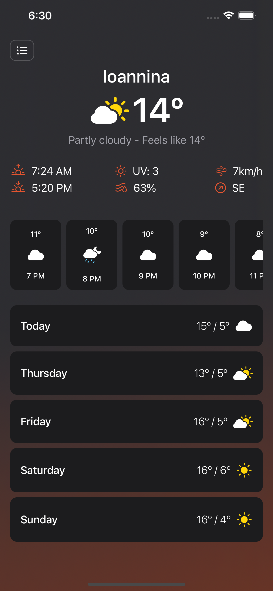

# SwiftUI-Weather-App 🌡️ ☀️

This App allows users get the current weather for a particular locatio and view a 5-day weather forecast for the selected place. Powered by World Weather Online API. Credits to those who have given the necessary knowledge required to acheive this goal.
 
### Screenshots

 

Libraries
---------
* [Swift Log](https://github.com/apple/swift-log.git)
* [Swinject](https://github.com/Swinject/Swinject.git)
* [Simple Toast](https://github.com/sanzaru/SimpleToast.git)
* [SwiftList](https://github.com/realm/SwiftLint)
* [SwiftGen](https://github.com/SwiftGen/SwiftGen)

